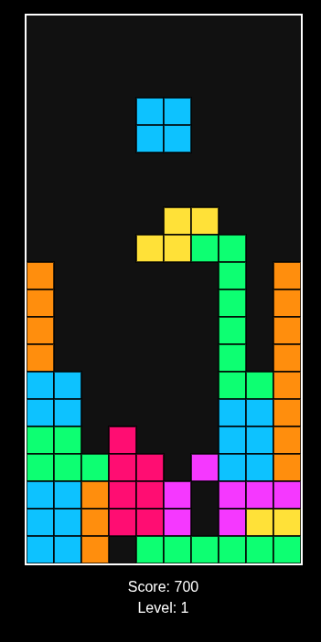

  
  
  # Quadris
  
  
  
  
  A modern, browser-based falling block puzzle game built with vanilla JavaScript and HTML5 Canvas.

## 🎮 Demo

Play the latest version: [Quadris Demo](https://rock808.com/games/quadris/)

## ✨ Features

- 🎯 Classic falling block gameplay with smooth controls
- 🎨 Clean, responsive design that works on desktop and tablet
- ⚡ Optimized performance with vanilla JavaScript
- 📊 Score tracking and level progression
- 🔄 Hard drop and rotation controls
- 👁️ Next piece preview
- 🎯 Progressive difficulty increase
- 🎨 Clean, responsive design

## 🚀 Getting Started

### Prerequisites
- Modern web browser (Chrome, Firefox, Safari, Edge)
- No installation required - works directly in the browser

### How to Play
1. Open `quadris-v003.html` in your web browser
2. Use the following controls:
   - **← →** : Move piece left/right
   - **↑** : Rotate clockwise
   - **↓** : Soft drop (move down faster)
   - **Space** : Hard drop (instant drop)

## 🛠️ Development

### Project Structure
- `quadris-v003.html` - Current stable version (latest)
- `quadris-v002.html` - Previous version
- `quadris-v001.html` - Initial version (kept for reference)
- `CHANGELOG.md` - Version history and changes
- `PRD.md` - Product Requirements Document
- `LICENSE-MIT.txt` - MIT License file
- `quadris-01.png` - Game screenshot

### Building and Running
No build step required! Simply open `quadris-v003.html` in a web browser to play.

## 📈 Roadmap

### Next Up MVP (v0.1.0)
- [ ] any bugs fixed
- [ ] verify all keys function as expected

### Future Features
- [ ] Add 'P' key to pause game
- [ ] Add sound effects
- [ ] Implement high score system
- [ ] Add game start screen
- [ ] Mobile touch controls
- [ ] Responsive design improvements
- [ ] Different game modes
- [ ] Theme customization
- [ ] Multiplayer support
- [ ] Leaderboard integration
- [ ] Achievements system

## 🤝 Contributing

Contributions are welcome! Feel free to submit issues and pull requests.

1. Fork the repository
2. Create your feature branch (`git checkout -b feature/AmazingNewFeature`)
3. Commit your changes (`git commit -m 'Add some AmazingNewFeature'`)
4. Push to the branch (`git push origin feature/AmazingNewFeature`)
5. Open a Pull Request

## 📄 License

This project is licensed under the MIT License - see the [LICENSE-MIT.txt](LICENSE-MIT.txt) file for details.

## 👤 Author

**David Slimp**
- GitHub: [@david-slimp](https://github.com/david-slimp)
- Email: coder@David-Slimp.com

## 🙏 Acknowledgments

- Inspired by classic falling blocks games
- Built with vanilla JavaScript and HTML5 Canvas
- Special thanks to the open source community

---

  Made with ❤️ by David Slimp

